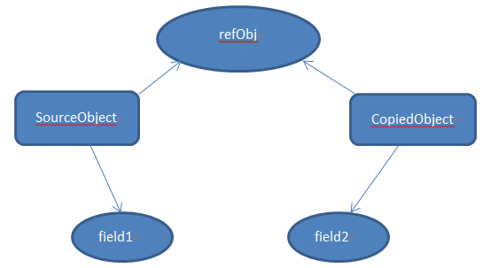

<br>

## 前言

本人平时学习及收集内容，欢迎参入一起讨论。

## 关于作者

一个工作八年的草根程序员。

## 内容

- [理解问题原因所在](#一理解问题原因所在)
- [深拷贝和浅拷贝的区别](#二深拷贝和浅拷贝的区别)
- [实现对象和数组浅拷贝](#三实现对象和数组浅拷贝)
- [实现对象和数组深拷贝](#四实现对象和数组深拷贝)

### 一、理解问题原因所在

JavaScript 中的数据类型可以分为两种：基本类型值（Number,Boolean,String,NULL,Undefined）和引用类型值（Array,Object,Date,RegExp,Function）。基本类型指的是简单的数据段，而引用类型值指那些可能由多个值构成的对象。

**基本数据类型是按值访问的**，因为可以直接操作保存在变量中的实际的值。引用类型的值是保存在内存中的对象，与其他语言不同，JavaScript 不允许直接访问内存中的位置，也就是说不能直接操作对象的内存空间。在操作对象时，实际上是在**操作对象的引用**而不是实际的对象。 为此，引用类型的值是按引用访问的。

除了保存的方式不同之外，在从一个变量向另一个变量复制基本类型值和引用类型值时，也存在不同：

- 如果从一个变量向另一个变量复制基本类型的值，会在变量对象上创建一个新值，然后把该值复制到为新变量分配的位置上。
- 当从一个变量向另一个变量复制引用类型的值时，同样也会将存储在变量对象中的值复制一份放到为新变量分配的空间中。不同的是，这个值的副本实际上是一个指针，而这个指针指向存储在堆中的一个对象。复制操作结束后，两个变量实际上将引用同一个对象。因此，改变其中一个变量，就会影响另一个变量。

看下面的代码：

```
// 基本类型值复制
var string1 = 'base type';
var string2 = string1;

// 引用类型值复制
var object1 = {a: 1};
var object2 = object1;

```

下图可以表示两种类型的变量的复制结果：


至此，我们应该理解：在 JavaScript 中直接复制对象实际上是对引用的复制
，会导致两个亦是引用同一个对象，对任一亦是的个性都会反映到另一个变量上，这是一节总是原因所在。

### 二、深拷贝和浅拷贝的区别

- [浅拷贝](#21-浅拷贝)
- [深拷贝](#22-深拷贝)
- [浅拷贝与深拷贝区别](#23-浅拷贝与深拷贝区别)

#### 2.1 浅拷贝

创建一个新对象，这个对象有着原始对象属性值的一份精确拷贝。如果属性是基本类型，
拷贝的就是基本类型的值，如果属性是引用类型，拷贝的就是内存地址，所以如果其中一个对象改变了这个地址，就会影响到另一个对象。



上图中，`SourceObject`是原对象，其中包含基本类型属性`filed1`和引用类型属性`refObj`。浅贝之后基本类型数据`field2`和`filed1`是不同属性，互不影响。但引用类型`refObj`仍然是同一个，改变之后会对另一个对象产生影响。

简单来说可以理解为浅拷贝只解决了第一层的问题，拷贝第一层的**基本类型值**，以及第一层的**引用类型地址**。

#### 2.2 深拷贝

深拷贝会拷贝所有的属性，并拷贝属性指向的动态分配的内存。当对象和它所引用的对象一起拷贝时即发生深拷贝。深拷贝相比于浅拷贝速度较慢并且花销较大。拷贝前后两个对象互不影响。


#### 2.3 浅拷贝与深拷贝区别

| --     | 和原数据是否指向同一对象 | 第一层数据为基本数据类型 | 原数据中包含子对象       |
| ------ | ------------------------ | ------------------------ | ------------------------ |
| 赋值   | 是                       | 改变会使原数据一同改变   | 改变会使原数据一同改变   |
| 浅拷贝 | 否                       | 改变不会使原数据一同改变 | 改变会使原数据一同改变   |
| 深拷贝 | 否                       | 改变不会使原数据一同改变 | 改变不会使原数据一同改变 |

### 三、实现对象和数组浅拷贝

- 使用 Object.assign 方法
- 展开语法 Spread
- 使用 Object.getOwnPropertyNames 拷贝不可枚举的属性
- 使用 Object.getPrototypeOf 和 Object.getOwnPropertyDescriptor 拷贝原型与描述符
- 使用 slice 和 concat 方法

#### 3.1 使用 Object.assign 方法

`Object.assing()`用于将一个或多个源对象中的所有`可枚举的属性`值复制到目标对象

```
var object1 ={
    a:1,
    obj:{
        b:'string'
    }
};

// 浅拷贝
var copy = Object.assign({},object1);
// 改变原对象属性
object1.a =2;
object1.obj.b = 'newString';

console.log(copy.a); // 1
console.log(copy.obj.a);    // newString

```

上面代码改变对象 object1 之后，对象 copy 的基本属性保持不变。但是当改变对象 object1 中的对象`obj`时，对象 copy 相应的位置也发生了变化。

#### 3.2 展开语法 Spread

```
// tony
let a = {
    name: "tony",
    book: {
        title: 'You don`t Know JS',
        price: '45'
    }
}
let b = {...a};
console.log(b);

// {
// 	name: "tony",
// 	book: {title: "You Don't Know JS", price: "45"}
// }

a.name = 'change';
a.book.price = '55';
console.log(a);
// {
// 	name: "change",
// 	book: {title: "You Don't Know JS", price: "55"}
// }

console.log(b);
// {
// 	name: "tony",
// 	book: {title: "You Don't Know JS", price: "55"}
// }

```

通过代码可以看出实际效果和`Object.assign()`是一样的。

#### 3.3 使用 Object.getOwnPropertyNames 拷贝不可枚举的属性

`Object.getOwnPropertyNames()`返回由对象属性组成的一个数组，包括不可枚举的属性(除了使用 Symbol 的属性)。

```
function shallowCopyOwnProperties(source){
    var target = {};
    var keys = Object.getOwnPropertyNames(original);
    for ( var i=0;i<keys.length;i++){
        target[keys[i]] = source[keys[i]];
    }
    return target;
}
```

#### 3.4 使用 Object.getPrototypeOf 和 Object.getOwnPropertyDescriptor 拷贝原型与描述符

如果我们需要拷贝原对象的原型和描述符，我们可以使用`Object.getPrototypeOf`和`Object.getOwnPropertyDescriptor`方法分别获取原对象的原型和描述符，然后使用`Object.create`和`Object.defineProperty`方法，根据原型和属性的描述符创建新的对象和对象的属性。

```
function shallowCopy(source){
    // 用source的原型创建一个对象
    var target = Object.create(Object.getPrototypeOf(source));
    // 获取对象的所有属性
    var keys = Object.getOwnPropertyNames(source);
    // 循环拷贝对象的所有属性
    for( var i=0;i<keys.length;i++){
        // 用原属性的描述符创建新的属性
        Object.defineProperty(target,keys[i],Object.getOwnPropertyDescriptor(source,keys[i]));
    }
    return target;
}
```

#### 3.5 使用 slice 和 concat 方法

concat 使用如下：

```
var arr = ['old',1,true,null,undefined];

var new_arr = arr.concat();

new_arr[0] = 'new';

console.log(arr);   // ["old", 1, true, null, undefined]

console.log(new_arr); // ["new", 1, true, null, undefined]

```

用 slice 可以这样做

```
var arr = [{old: 'old'}, ['old']];

var new_arr = arr.concat();

arr[0].old = 'new';
arr[1][0] = 'new';

console.log(arr) // [{old: 'new'}, ['new']]
console.log(new_arr) // [{old: 'new'}, ['new']]

```

### 四、实现对象和数组深拷贝

- 使用 JSON.stringify 和 JSON.parse 方法
- 使用递归
- 使用队列
- 使用哈希表

#### 4.1 使用 JSON.stringify 和 JSON.parse 方法

JSON.stringify 和 JSON.parse 是 JavaScript 内置对象 JSON 的两个方法，主要是用来将 JavaScript 对象序列化为 JSON 字符串和把 JSON 字符串解析为原生 JavaScript 值。

```
var obj = {a:1,b:{c:2}};

// 深拷贝
var newObj = JSON.parse(JSON.stringify(obj));
// 改变原对象的属性
obj.b.c = 20;

console.log(obj);   // {a:1,b:{c:20}}
console.log(newObj);    // {a:1,b:{c:2}}

```

该方法有以下几个问题

- 会忽略`undefined`
- 会忽略`symbol`
- 不能序列化函数
- 不解决循环引用的对象
- 不能正确处理`new Date()`
- 不能处理正则

#### 4.2 使用递归

递归是一种常见的解决这种问题的方法：我们可以定义一个函数，遍历对象的属性，当对象的属性是基本类型值得时候，直接拷贝；当属性是引用类型值的时候，再次调用这个函数进行递归拷贝。这是基本的思想，下面看具体的实现（不考虑原型，描述符，不可枚举属性等，便于理解）：

```
function deepClone(source){
    // 递归终止条件
    if (!source || typeof source !== 'object'){
        return source;
    }
    var targetObj = source.construct === Array ? [] :{};
    for (var key in source){
        if (Object.prototype.hasOwnProperty.call(source,key)){
            if(source[key] && typeof source[key] === 'object'){
                targetObj[key] = deepClone(source[key]);
            }else{
                targetObj[key] = source[key];
            }
        }
    }
    return targetObj;
}
```

上面的深拷贝只是比较简单的实现，没有考虑很复杂的情况，比如：

- 其他引用类型：Function，Date，RegExp 的拷贝
- 对象中存在循环引用会导致调用栈溢出
- 通过闭包作用域来实现私有成员的这类对象不能真正的被拷贝

**什么是闭包作用域**

```
function myConstructor(){
    var myPrivateVar = 'secret';
    return {
        myPublicVar : 'public',
        getMyprivateVar:function(){
            return myPrivateVar;
        },
        setMyPrivateVar(value){
            myPrivateVar = value.toString();
        }
    }
}

var o= myContructor();
```

上面的代码中，对象 o 有三个属性，一个是字符串，另外两个是方法。方法中用到一个变量`myPrivateVar`，存在于`myConstructor()`的函数作用域中，当`myConstructor`构造函数调用时，就创建了这个变量`myPrivateVar`，然而这个变量并不是通过构造函数的对象`o`的属性，但是它任然可以被这两个方法使用。

因此，如果尝试深拷贝对象`o`，那么拷贝对象`clone`和被拷贝对象`original`中的方法都是引用相同的`myPrivateVar`变量。

#### 4.3 使用队列

递归的做法虽然简单，容易理解，但是存在一定的性能问题，对拷贝比较大的对象来说不是很好的选择。

理论上来说，递归是可以转化成循环的，我们可以尝试着将深拷贝中的递归转化成循环。我们需要遍历对象的属性，如果属性是基本类型，直接复制，如果属性是引用类型（对象或数组），需要再遍历这个对象，对他的属性进行相同的操作。那么我们需要一个容器来存放需要进行遍历的对象，每次从容器中拿出一个对象进行拷贝处理，如果处理过程中遇到新的对象，那么再把它放到这个容器中准备进行下一轮的处理，当把容器中所有的对象都处理完成后，也就完成了对象的拷贝。

思想大致是这样的，下面看具体的实现：

```

// 利用队列的思想优化递归
function deepClone(source){
    if(!source || typeof source !=='object'){
        return source;
    }
    var current;
    var target = source.constructor === Array ? [] : {};
    // 用数组作为容器
    // 记录被拷贝的原对象和目标
    var cloneQueue = [{
        source,
        target
    }];

    while (current = cloneQueue.shift()){
        for (var key in current.source){
            if(Object.prototype.hasOwnProperty.call(current.source,key)){
                if(current.source[key] && typeof current.source[key] === 'object'){
                    current.target[key] == current.source[key].constructor === Array ? []:{};
                    cloneQueue.push({
                        source: current.source[key],
                        target:current.target[key]
                    });
                }else{
                    current.target[key] = current.source[key];
                }
            }
        }
    }
    return target;
}

```

#### 使用哈希表

解决方案很简单，其实就是循环检测，我们设置一个数组或者哈希表存储已拷贝过的对象，当检测到当前对象已存在于哈希表中时，取出该值并返回即可。

```

function cloneDeep3(source,hash = new WeakMap()){
    if(!isObject(source)) return source;
    if(hash.has(source)) return hash.get(source);   // 新增代码查哈希表

    var target = Array.isArray(source) ? [] : {};
    hash.set(source,target);    // 新增代码，哈希表设值

    for(var key in source){
        if(Object.prototype.hasOwnProperty.call(source,key)){
            if(isObject(source[key])){
                target[key] = cloneDeep2(source[key]); // 注意这里
            } else {
                target[key] = source[key];
            }
        }
    }
    return target;
}

```

### 参考资料

- [深入理解 JavaScript 对象和数组拷贝](https://juejin.im/post/5a00226b5188255695390a74)
- [详细解析赋值、浅拷贝和深拷贝的区别](https://muyiy.vip/blog/4/4.1.html)
- [JavaScript 专题之深浅拷贝](https://github.com/mqyqingfeng/Blog/issues/32)
- [深入剖析 JavaScript 的深复制](https://jerryzou.com/posts/dive-into-deep-clone-in-javascript/)
- [深拷贝的终极探索（99%的人都不知道）](https://segmentfault.com/a/1190000016672263)

## 联系作者

<div align="center">
    <p>
        平凡世界，贵在坚持。
    </p>
    
</div>
