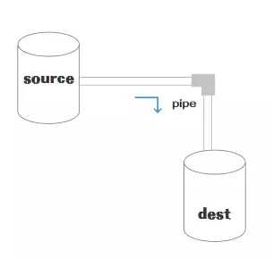

<br>

## 关于作者

一个工作八年的草根程序员。

## 内容

- 流接口简介
- Stream分类

### 一、流接口简介

流（stream）是Node.js中处理流式数据的抽象接口。`Node.js`中很多对象都实现了流，流是`EventEmitter`对象的一个实例。



访问`stream`模块：

```
const stream = require('stream');
```

### 二、Stream分类

在nodejs中，有四种stream类型：

- **Readable：**用来读取数据，比如`fs.createReadStrem()`。
- **Writable：**用来写数据，比如`fs.createWriteStream()`。
- **Duplex：**可读+可写，比如`net.Socket()`。
- **Transform：**在读写的过程中，可以对数据进行修改，比如`zlib.createDeflat()`（数据压缩/解压）。

#### 2.1 Readable

```
```

#### 2.2 Writable

```
```

#### 2.3 Duplex

```
```

#### 2.4 Transform

```
```

### 参考资料

- 《node.js高级编程》
- [Stream 模块](https://github.com/wscats/node-tutorial/tree/master/tutorial/stream)
- [理解Stream模块](https://github.com/chyingp/nodejs-learning-guide/blob/master/%E6%A8%A1%E5%9D%97/stream.md)
- [想学Node.js，stream先有必要搞清楚](https://juejin.im/post/5d25ce36f265da1ba84ab97a)


## 联系作者

<div align="center">
    <p>
        平凡世界，贵在坚持。
    </p>
    
</div>